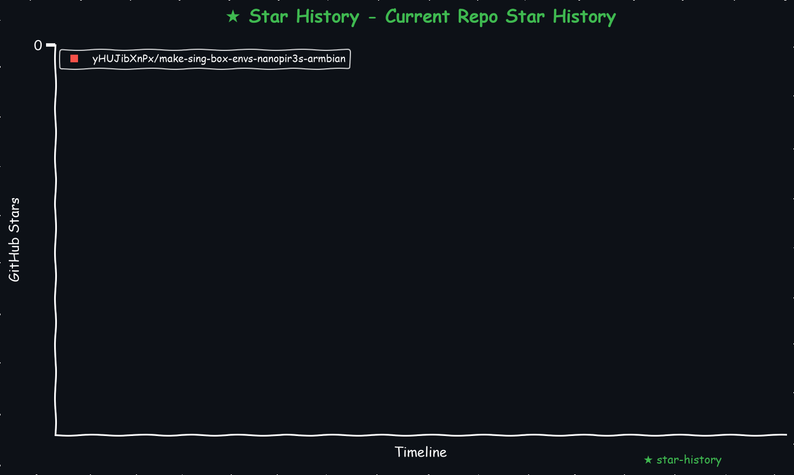

# make-sing-box-envs-nanopir3s-armbian
Sing-Box 一键搭建配置脚本（适配 nanopir3s armbian）可用做网关代理

    
<!-- <a href="https://star-history.com/#yHUJibXnPx/make-sing-box-envs-nanopir3s-armbian&Date">
  <picture>
    <source media="(prefers-color-scheme: dark)" srcset="https://api.star-history.com/svg?repos=yHUJibXnPx/make-sing-box-envs-nanopir3s-armbian&type=Date&theme=dark" />
    <source media="(prefers-color-scheme: light)" srcset="https://api.star-history.com/svg?repos=yHUJibXnPx/make-sing-box-envs-nanopir3s-armbian&type=Date" />
    
  </picture>
</a> -->
<!-- START_STAR_HISTORY_SELF -->

<!-- END_STAR_HISTORY_SELF -->

## 目录结构
    .
    ├── make-sing-box-env.sh                        # sing-box 环境搭建脚本  
    ├── 1.15.0-alpha.3.json                         # sing-box json 模板  
    ├── LICENSE                                     # TIM 协议  
    ├── requestment.txt                             # Python脚本所需依赖  
    ├── make_star_chart.py                          # 生成 星星统计 脚本  
    └── README.md                                   # 项目描述  

在使用本脚本前阅读这篇文章，能更好的理解我为什么开发这个项目
[ubuntu linux nanopi r3s 全局路由网关配置](https://469138946ba5fa.blogspot.com/search?q=ubuntu+linux+nanopi+r3s+%E5%85%A8%E5%B1%80%E8%B7%AF%E7%94%B1%E7%BD%91%E5%85%B3%E9%85%8D%E7%BD%AE)  

本脚本用于在 **Linux** 系统上自动化完成以下任务：

* 注意本脚本不会自动安装 python 环境，每个人的系统都很复杂，请自行安装挑选 python 环境
* 安装依赖工具（如 `unzip` `unar` `uuid` 等）
* 下载并配置 [sing-box](https://github.com/SagerNet/sing-box) 内核
* 在线订阅转换并生成 Sing-Box 兼容的配置文件
* 配置本地 UI、Geo 数据文件
* 自动生成并启动本地代理服务
* 提供可执行启动脚本 `sing-box-start.sh`

---

## ⚠️ 注意事项
* 需要提前设置好有线网卡 eth0 为固定的 ip gateway dns 比如我的路由器 ip 是 192.168.255.254 内网环境是 192.168.255.0/24 设备 ip 192.168.255.253 gateway 192.168.255.254 ~dns 192.168.255.253 或 127.0.0.1 这样保证设备 dns 可以被 sing-box 拦截~ armbian 会使用 systemd-r 强行占用 53 端口，所以本机 dns 和局域网设备的 dns 最好都配置为公共dns比如 8.8.8.8 或 1.1.1.1
* 😑关于先有鸡还是先有蛋的问题，说来可笑想搭建代理环境，必须要有代理环境，哎，太可笑了，太可悲了，哎
  * 本脚本会安装 unzip, uuid 和 unar 工具，这需要代理环境，请配置临时代理环境执行本脚本直到结束，哎
* 本脚本依赖 python 环境请自行好提前准备好，本脚本会生成 python 脚本，用于解析json，为支持tls的节点插入 tls.insecure="true"  
* 如需**全局路由**，请将路由器 DHCP 下发 Gateway 和 DNS ~强制为本机 IP~ 最好都配置为公共dns比如 8.8.8.8 或 1.1.1.1，不要将 DNS 设置为 172.19.0.1 或 fake-ip 地址
* 如需**旁路由**，请将路由器或设备 Gateway 和 DNS ~强制为本机 IP~ 最好都配置为公共dns比如 8.8.8.8 或 1.1.1.1，不要将 DNS 设置为 172.19.0.1 或 fake-ip 地址
* 如需**端口代理**，请将联网代理设置为本机 IP:7890
* 若出现网络策略未生效，请检查系统是否允许 `utun` 接口访问网络
* 为启用系统级转发，会尝试设置 `net.ipv4.ip_forward=1`，需要管理员权限
* 本脚本会自己检测桌面是否包含 $HOME/Desktop/sing-boxs 目录，如果存在则会自动拼接 uuid 作为新目录在桌面创建
  * 例如 $HOME/Desktop/sing-boxs-19AF2BFC-8B73-4678-992C-01BE6045C635
* 脚本中的json模板文件使用加速源链接`gcore.jsdelivr.net`和`gh-proxy.com`，效果不一定好，你需要多次启动测试，不行的话就替换其他加速的链接测试
  * 一开始我在DNS规则中配置了 dhcp 类型的 dns_dhcp 如果我没理解错的话应该借此可以使用本地dhcp配置下载规则，但是会自己拼接.lan当域名解析，这不扯蛋吗？  
  * 目前远程下载规则文件没有太好的办法，后来我就想，以 dhcp 的 dns_dhcp 为基础路由创建 udp 的 dns_direct 来解析规则文件的链接，希望能下载顺利吧  
  ```plaintext
  # 替代链接
  fastly.jsdelivr.net
  testingcf.jsdelivr.net
  cdn.jsdelivr.net
  
  # SagerNet/sing-geosite 一一对照
  https://github.com/SagerNet/sing-geosite/raw/refs/heads/rule-set
  https://gcore.jsdelivr.net/gh/SagerNet/sing-geosite@rule-set
  
  # SagerNet/sing-geosite 一一对照
  https://github.com/SagerNet/sing-geoip/raw/refs/heads/rule-set
  https://gcore.jsdelivr.net/gh/SagerNet/sing-geoip@rule-set

  # 替代链接
  hk.gh-proxy.com
  cdn.gh-proxy.com
  edgeone.gh-proxy.com

  # Zephyruso/zashboard 一一对照
  https://github.com/Zephyruso/zashboard/releases/latest/download/dist.zip
  https://gh-proxy.com/https://github.com/Zephyruso/zashboard/releases/latest/download/dist.zip
  ```
* 如果你实在受不了因为规则无法下载全而反复手动重试启动，那你可以受着  

## 💻 支持平台

* 支持 **Linux** 额支持 ARM 架构（比如 nanopir3s）  

---

## 🚀 使用方法(假设默认创建的是 $HOME/Desktop/sing-boxs 目录)

1. 打开终端下载脚本，例如：

   ```bash
   mkdir -pv $HOME/Desktop
   cd $HOME/Desktop
   curl -L -C - --retry 3 --retry-delay 5 --progress-bar -o 'make-sing-box-env.sh' 'https://github.com/yHUJibXnPx/make-sing-box-envs-nanopir3s-armbian/raw/refs/heads/master/make-sing-box-env.sh'
   ```

2. 给脚本授权并执行：

   ```bash
   chmod +x ./make-sing-box-env.sh
   ./make-sing-box-env.sh
   ```

3. 根据提示输入以下内容（可回车使用默认值）：

   * 订阅链接（可自定义或使用默认）
   * 规则策略模板链接
   * 在线订阅转换 API 链接

4. 安装完成后，将生成配置文件与可执行二进制：

   ```plaintext
   $HOME/Desktop/sing-boxs
    ├── 1.15.0-alpha.3.json
    ├── config_with_nodes.json
    ├── config.json
    ├── config.json.bak
    ├── filtered_nodes.json
    ├── group_patterns.txt
    ├── sing-box
    ├── sing-box_config
    │   ├── box.log
    │   ├── cache.db
    │   ├── geoip-cn.srs
    │   ├── geosite-category-ads-all.srs
    │   ├── geosite-geolocation-!cn.srs
    │   ├── ui
    │   └── ui.zip
    ├── sing-box-1.15.0-alpha.3-linux-arm64.tar.gz
    ├── sing-box-start.sh
    ├── subs-fix.py
    └── temp_config.json
   ```

5. 按照脚本提示启动 Sing-Box tun 代理：

   ```bash
   # 订阅链接下载处理等会固化在 sing-box-start.sh 脚本中，此后想用就直接执行这个脚本即可
   $HOME/Desktop/sing-boxs/sing-box-start.sh
   ```

---

## 📦 自动安装依赖

本脚本将检查并自动安装以下依赖：

* `unar`（用于解压 `.gz`, `.zip` 文件）
* `unzip`（用于解压 `.zip` 文件）
* `uuid`（用于生成时间戳）

---

## 🧩 配置说明

* 默认配置启用了 **TUN 模式** 和 **Fake-IP DNS 模拟**，适用于全局代理、旁路由和端口代理
* 配置文件路径：`$HOME/Desktop/sing-boxs/config.json`
* Web UI 端口：`http://localhost:9999/ui/`
* 默认监听端口：
  * external-controller: 9999
  * http/socks5 代理：7890
* json 模板文件中的4个规则文件使用参考，如果你有好的规则提议可以推荐给我，我不清楚这些文件是否有重复的可能
  ```yaml
  - 国内访问规则
    - "geoip-cn"
    - "geosite-cn"
  - 国外访问规则
    - "geosite-openai"
    - "geosite-geolocation-!cn"
  - 拦截规则
    - "geosite-category-ads-all"
  ```

---

## 🔧 自定义订阅转换

本脚本支持通过在线 API 将原始订阅链接转换为 Sing-Box 格式。

默认 API 为：

```
https://sub.d1.mk/sub
```

可自行替换为其他 Sing-Box 订阅转换服务，只需支持如下参数结构：

```
?target=singbox&insert=true&url=<订阅链接>
```

---

## ❓ 常见问题

**Q: 为什么安装 unzip unar uuid 失败？**  
A: 说来有些可笑，你可能需要为了搭建代理环境而不得不临时使用代理完成这个流程，属实是有些`先有鸡还是先有蛋`了，如果你有能力确实可以修改优化这个脚本，比如将全部链接换成国内网路支持的版本，这样就能完成整套流程了。


**Q: 为什么 curl 命令在脚本中不生效？**  
A: 可能是 `$SUB_URL` 未被正确 URL 编码，脚本已内置编码函数 `urlencode()`。若有问题请手动检查 `${TMP_FILE}` 是否为空。

**Q: 为什么通过7890端口能访问的网站，而通过路由器强制下发DHCP却报错ssl_cert相关的问题？**  
A: 这涉及到一个非常经典的问题，我的配置文件用的 `fake-ip` 作为 `DNS` 解析策略，TUN + fake-ip + MITM 是直接接管 TCP 流量并劫持 TLS，所以需要伪造证书与客户端完成握手。  
如果证书未被信任、缺失、SAN 不匹配，就会触发 ssl_cert 或 certificate_verify_failed 报错。  
7890 走的是 HTTP 代理协议（即使访问的是 HTTPS），浏览器先发一个 CONNECT 请求到代理，代理只是转发 TLS 流量，不解密，所以不需要伪造证书。  

**Q: 配置文件为空或不完整？**  
A: 检查你输入的订阅链接和规则模板链接是否能通过浏览器访问。

**Q: 你的测试节点哪里来的？这个问题就不要在私信我了哦。**  
A: 动动你的小手，打开浏览器，打开搜索框输入关键词有且不限于以下信息，按回车，你大概率能搜索到  
  `site: baidu.com 2026 clash base64 免费节点`,   
  `site: google.com 2026 clash base64 免费节点`,   
  `site: bing.com 2026 clash base64 免费节点`,   
  `site: duckduckgo.com 2026 clash base64 免费节点`,   
  `site: yahoo.com 2026 clash base64 免费节点`,  
  `site: yandex.com 2026 clash base64 免费节点`,...   


---

## 🧼 卸载（可选）

若要清理所有文件：

```bash
# 1. 实时禁用 IP 转发移除 /etc/sysctl.d/99-forwarding-singbox.conf
sudo rm -fv /etc/sysctl.d/99-forwarding-singbox.conf
# 加载并启用 ip 转发
sudo systemctl restart systemd-sysctl
sudo sysctl -p
# 应该能看到规则恢复
sudo sysctl net.ipv4.ip_forward
sudo sysctl net.ipv6.conf.all.forwarding

# 2. 终止 sing-box 进程
echo "终止 Sing-Box 进程（如有）..."
sudo pkill -f 'sing-box -D' || echo "未找到 Sing-Box 进程，跳过。"

# 3. 删除整个代理目录
sudo rm -rf $HOME/Desktop/sing-boxs*
```
## 许可证
本项目采用 [MIT License](LICENSE) 许可。

## 联系与反馈
遇到问题或有改进建议，请在 [issues](https://github.com/yHUJibXnPx/make-sing-box-envs-nanopir3s-armbian/issues) 中提出，或直接联系项目维护者。

## 参考
[github/Homebrew install](https://github.com/Homebrew/install)  
[github/juewuy ShellCrash](https://github.com/juewuy/ShellCrash)  
[在线订阅转换 sub.d1.mk](https://sub.d1.mk/sub)  
[github/SagerNet sing-box](https://github.com/SagerNet/sing-box)  
[github/Zephyruso zashboard](https://github.com/Zephyruso/zashboard)  
[github/SagerNet geoip.db](https://github.com/SagerNet/sing-geoip/releases/latest/download/geoip.db)  
[github/SagerNet geosite.db](https://github.com/SagerNet/sing-geosite/releases/latest/download/geosite.db)  
[neomikanagi/megamori ads list](https://github.com/neomikanagi/megamori)  
[www.panlongid.com freenodeshare](https://www.panlongid.com/category/freenodeshare)  
[github.com/Toperlock sing-box-subscribe](https://github.com/Toperlock/sing-box-subscribe)  
[jsdelivr加速](https://www.jsdelivr.com)  
[Public_recursive_name_server 公共DNS解析服务](https://en.wikipedia.org/wiki/Public_recursive_name_server)  
# 声明
本项目仅作学习交流使用，用于解决生理需求，学习各种姿势，不做任何违法行为。仅供交流学习使用，出现违法问题我负责不了，我也没能力负责，我没工作，也没收入，年纪也大了，你就算灭了我也没用，我也没能力负责。
